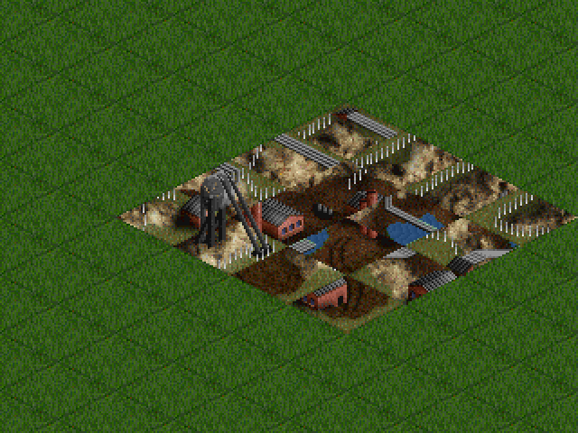
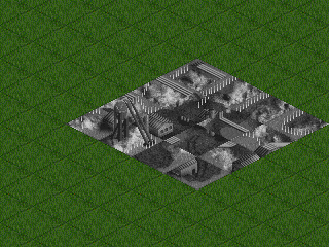
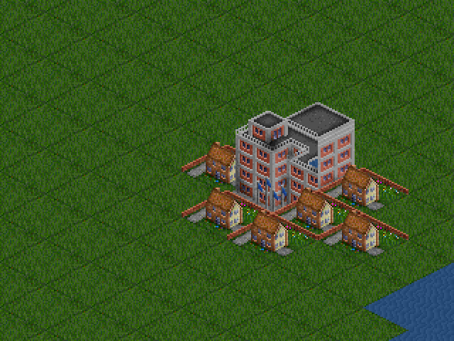
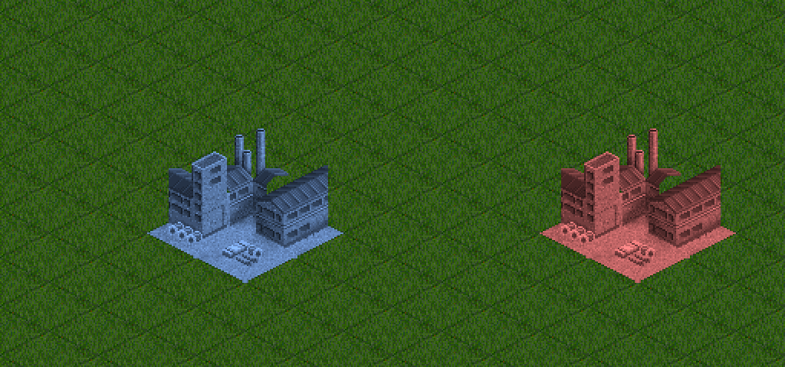
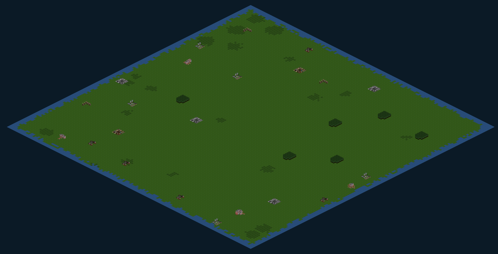

# T1–T4 handover completion and visual review

**Date:** 2026-09-08

**Input:** `01a07ce9-e356-708e-9864-ff1d6364d202.patch` and [incoming handover](../HexMatch-handover.md)

## Scope decision

The patch's **144×144** interpretation is retained: three times **each dimension**
of the old 48×48 map, hence **nine times the area**, not three times the area.
Counts remain **25 industries and four towns** (6–12 tiles per town):
5 farms, 6 forests, 5 ore mines, 4 quarries, 3 oil rigs and 2 gold mines.
This gives existing industries/towns more room rather than adding more of them.

The input patch had binary placeholders rather than applicable binary payloads.
Its text changes were applied; the required house PNGs were restored from
OpenGFX commit `c51c904f4f6e7466ee73f907520ef7ea9a53bcbb`, and the generated
atlases were rebuilt locally. The misspelled `temperptbuilds.png` was a JSON
404 response and is not shipped. Only the three house sheets actually used
by the atlas are included; OpenGFX's GPLv2 provenance is retained.

## T1 — Gold mine and quarry

- Finished sprites **2247–2262 are ground layers**, once each, not buildings
  stacked over coal-mine dirt.
- Only tile **m79 at (1,3)** adds the shaft tower. Frames **2263, 2264, 2265**
  run at 200 ms. Frame zero is no longer also in the shared base; that would
  leave a second tower behind subsequent animation frames.
- The quarry mirrors every tile/frame. Visual inspection caught the original
  `[138,138,138]` multiplicative tint merely darkening brown/gold pixels.
  The same target colour now uses **luminance tinting**, producing a genuinely
  grey stone reskin while preserving shading. A pixel regression checks this.
- Grounds **2256, 2257, 2260** intentionally remain static. Their palette
  shimmer requires palette cycling; no extra ground/building layer fakes it.





## T2 — Towns

Town cells now use complete-stage temperate house art instead of industry
sheds and a bank. Each cell is a declared 1×1 ground/building composite:

| Cell | Ground | Building | Role |
|---|---:|---:|---|
| `town_center` | 1420 | 1450 | Hotel landmark |
| `town_house_a` | 1447 | 1446 | Small house |
| `town_house_b` | 1420 | 1460 | Small office |
| `town_house_c` | 1424 | 1423 | Taller office |

The initial equal mix produced blocks of tall offices hiding the small houses
and landmark. The deterministic coordinate hash now weights small houses
5/8, small offices 2/8, tall offices 1/8. No runtime randomness is introduced.
PNML anchors remain authoritative; there are no hand-adjusted sprite offsets.
The atlas packer's final-row height was also corrected so the final tall
house cannot be cropped by the atlas boundary.



## T3 — Factory

The incoming authoritative mapping is preserved, **not shuffled**:

| Offset | Ground | Building |
|---|---:|---:|
| (0,0) | 2146 | 2150 — chimneys |
| (0,1) | 2147 | 2151 |
| (1,0) | 2148 | 2152 |
| (1,1) | 2149 | None — yard |

Both players' colours apply to **all ground and building layers**, including
the empty yard. All four cells retain their PNML-derived anchors.

Real-pointer testing exposed a related interaction bug: the front factory
pieces could hide its network anchor. In road/rail mode, clicking any piece
of your factory now selects that one connection anchor. Other tools and
structures retain their ordinary tile picking. The browser regression builds
from the factory to a harvester and verifies the free allowance, road pixels,
and +1 VP.



## T4 — Spacing, routing, camera and wire format

- Industry separation now targets **12 tiles**, with the existing quota-saving
  fallback strategy retained. Every town tile is at least **8 tiles** from
  industries; town centres target **28 tiles** apart, also with a fallback.
- Seeded generation, quota checks and all-map projection round trips cover
  the enlarged dimensions. Sampled core seeds retain the wider spacing and
  all four towns. The full even-step seed-1337 reachability sweep finds no
  isolated road-buildable pockets.
- A* uses a deterministic heap with the same lowest-index tie break. Before
  pathfinding, a conservative affordability bound rejects impossible plans;
  it accounts for existing trunks, upgrade pricing and road-only free track.
  Exact pathfinding and pricing still make the final decision.
- AI legality is shared with the player, including town occupancy. Road-only
  planning no longer repeats the road pass.
- The rival no longer gives up after eight distant probes and falls back to an
  unaffordable opening. It cheaply skips impossible candidates, then searches
  the remaining ranked spots for a real plan. Its default purse/allowance have
  **not** been increased. Regression coverage requires a real first-turn
  harvester from that actual opening budget.
- Structural sweep tests use sufficient road funds to distinguish route
  reachability from affordability. Separate actual-placement tests retain
  the opening budget. Timeouts are no longer inflated to several minutes.
- Camera/culling/demo bounds derive from map constants. Resizing preserves
  the world point at the viewport centre, including the initial CSS-to-device
  pixel resize on phones. The browser viewport matrix checks the initial focus.
- Snapshot version is **4**. Each road/rail/owner layer is 20,736 bytes,
  or 27,648 base64 characters. Old v3 clients are rejected before layer-size
  checks. The existing 256 KiB relay payload limit accommodates the expanded
  base snapshot (three layers total 82,944 base64 characters).

[Open the native 4704×2400 full-map render](2026-09-08-handover/map.png).
It is captured at **0.5×**, not scaled to fit a desktop viewport.



## Visual comparison and reproducibility

These are **real Chromium Canvas2D renders**, not mocked canvas tests or an
atlas contact sheet. `tools/capture-iso-review.mjs` loads the actual renderer,
map generator, depth sort, camera and packed atlases through Vite. Seed 1337
and animation phase zero make captures repeatable. No source sprite was
resized/repositioned to make a screenshot pass.

The original `image-1..5` referred to in the handover are not present in this
checkout. Comparison therefore used the mirrored OpenGFX sheets and PNML,
plus OpenTTD's sprite/layout tables, rather than claiming a comparison with
those unavailable attachments:

- [OpenGFX source revision](https://github.com/OpenTTD/OpenGFX/tree/c51c904f4f6e7466ee73f907520ef7ea9a53bcbb/sprites/png)
- [OpenTTD factory/industry sprite table](https://github.com/OpenTTD/OpenTTD/blob/0.7.5/src/table/industry_land.h)
- [OpenTTD town sprite table](https://github.com/OpenTTD/OpenTTD/blob/0.7.5/src/table/town_land.h)
- Local authoritative declarations: `src/assets/sprites/pnml/base/base-2011-industries.pnml`,
  `base-1440-houses.pnml`, `base-1420-houses-church.pnml`.

The visible 4×4 mine footprint, tower registration, grey quarry, varied town
silhouette, factory seams/chimneys/yard and full-map spacing were inspected.
No depth-sort cycles occurred in the review scenes. The handover's accepted
[farm](2026-09-08-handover/farm.png) and [ore mine](2026-09-08-handover/ore_mine.png)
were also rendered as unchanged control art.

```sh
node tools/parse-pnml.mjs
npm run slice-atlas
node tools/validate-manifest.mjs assets/iso-atlas/manifest.json
npm run dev -- --port 5173
# In another terminal:
node tools/capture-iso-review.mjs
```

Output defaults to ignored `test-results/iso-review/`. See
[`tools/README-art.md`](../../tools/README-art.md) for browser/URL overrides.

## Verification

| Check | Result |
|---|---|
| `npm run typecheck` | Pass, including e2e TypeScript |
| `npm run lint` | Pass; 0 errors, 27 pre-existing-style warnings |
| `npm test -- --silent` | **396/396**, 24 files, **84.02 s** |
| AI unit suite | **52/52**, **2.37 s** (initial patched 46-test suite: ~165 s) |
| AI sweep | **6/6**, **36.77 s** |
| Existing pixel goldens | **6/6 unchanged** |
| `npm run build` | Pass |
| Playwright full viewport matrix | **7 passed**, 9 intentionally skipped mobile mouse-only tests, **45.4 s** |
| PNML parser + atlas validation | Pass, 103 packed sprites |
| Atlas rebuild reproducibility | SHA-256-identical regeneration of all shipped atlas artifacts |

The sandbox could not download Playwright's default browser due to TLS failures.
Browser checks used Chromium **149.0.7827.0** with software rendering; no browser
package/dependency workaround is added to the repository. CI retains its normal
Playwright Chromium installation. Pixel reads wait for the actual render frame;
readback is asserted directly where software-GPU readback can outlast a poll's
sub-test timeout. Functional assertions have not been disabled.
