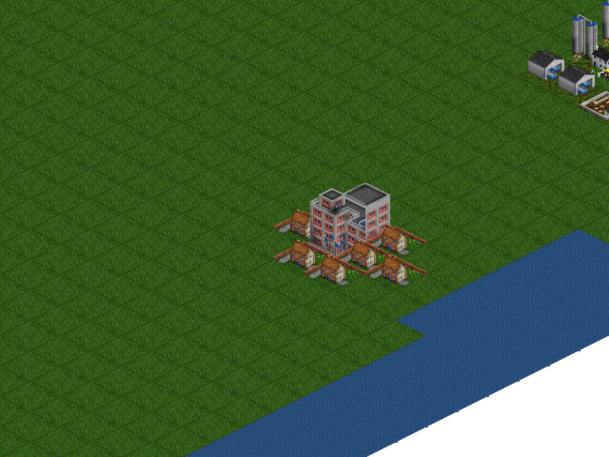
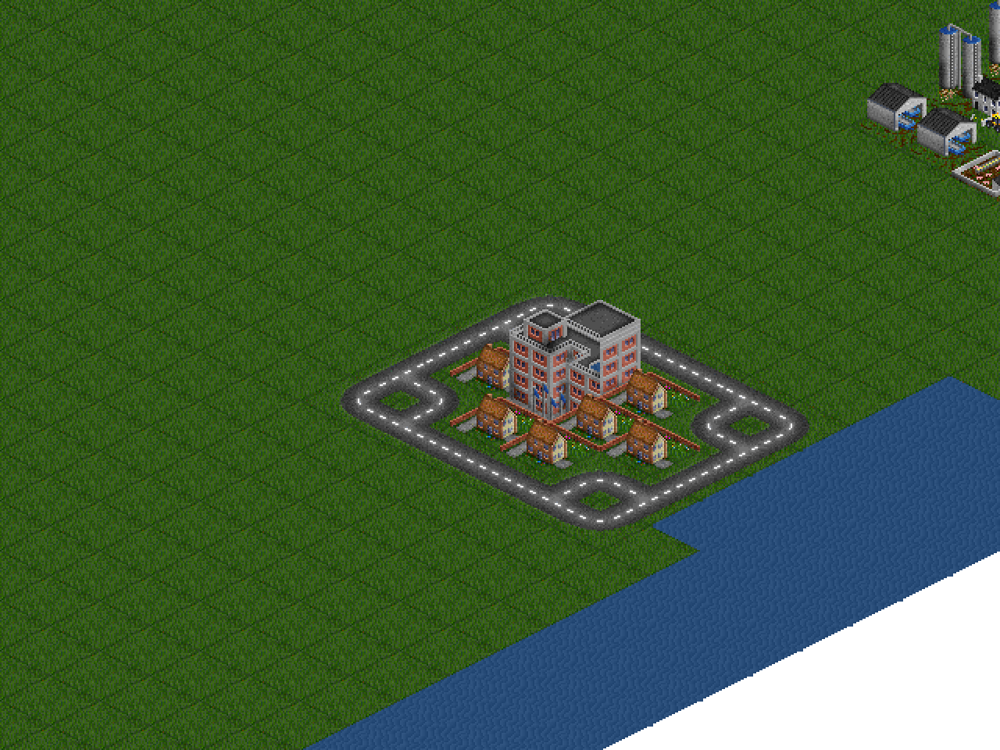
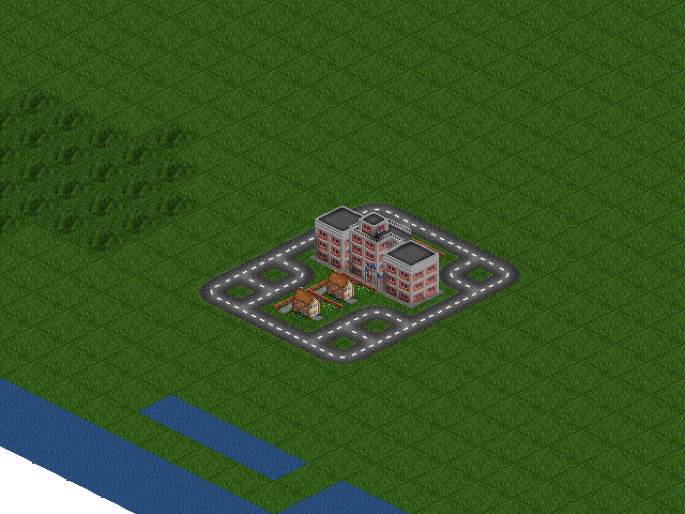
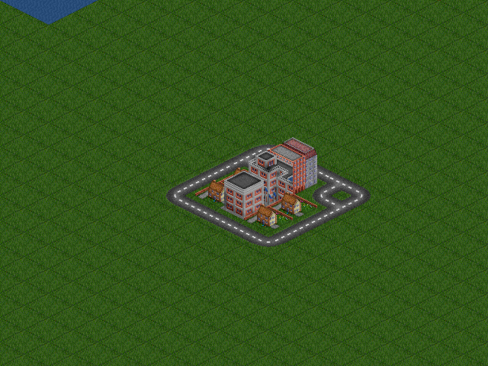
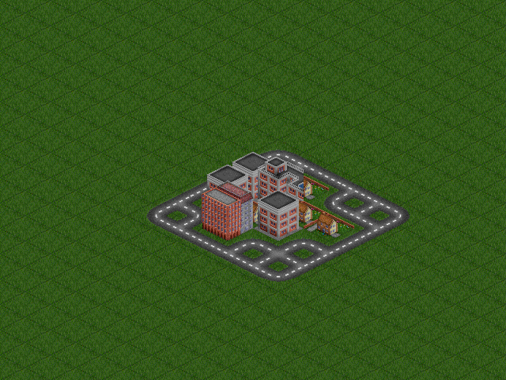

# PP-10 — towns get a simple road network at map generation

**Status: implemented.** Seed 1337, real `IsoRenderer` at zoom 2 (software
raster, no pixel repositioning — the renderer's own canvas readback).

| Town 0 — before | Town 0 — after (road loop breaks naturally at the water) |
|---|---|
|  |  |

The other three towns on the same map:

| Town 1 | Town 2 | Town 3 |
|---|---|---|
|  |  |  |

## What a town's road network is

Two pieces, both derived from the town's house cluster (deterministic — no
extra RNG draw, same seed → identical roads):

1. **The ring** — the perimeter of the house bounding box expanded by one
   tile: a ring road the settlement sits inside.
2. **The interior streets** — every free tile *inside* the box (the gaps the
   BFS-grown cluster leaves between houses along its edge, ~5 per town).

Piece 2 is load-bearing: the ring is a closed loop of town tiles, and any
free land it enclosed would become a road-buildable **enclave** — a pocket
the W8 sweep proves the rival's factory search must never commit to. Paving
the box's free tiles removes the pockets by construction, and every
box-edge street touches the ring, so the network is one connected piece
wherever the ring is unbroken.

## Rules the roads obey

- **Free land only**: in-bounds, not water, unoccupied. Rough is legal
  (roads build on rough). Water or an earlier town's tile simply leaves a
  gap — the autotile masks render the break (see town 0).
- **Town furniture, not a player asset**: road tiles are stamped
  `TOWN_OCC` in `grid.occupancy`, so `buildRefusal` answers
  "occupied" — nobody (human, AI, multiplayer) can build on, over, or
  demolish them.
- **Neutral on the track**: `seedTownRoads` stamps them onto the road layer
  with owner 0 at game boot, *before* the world exists (the first frame
  already shows settled towns). Every owner-scoped flood —
  `playerNetwork`, `buildComponents`, `isServiced` — ignores owner-0 tiles,
  so a town road can never hand a player a free connection, service a
  depot, or feed the rival's trunk discount.
- **Multiplayer**: the roads travel inside the snapshot's existing track
  bytes (no wire-shape change); `SNAPSHOT_VERSION` bumped 4 → 5 so
  mixed-version rooms refuse instead of showing a half-consistent map.

## Shape measurements (436 generated towns)

| Property | Observed | Guarded by `tests/unit/iso-town-roads.test.ts` |
|---|---|---|
| road tiles per town | 14 – 36 (avg 23.4) | `>= 10` |
| road tiles 4-adjacent to a house | min 7 | `>= 4` |
| largest road component | min 70.6 % of the town's tiles | `>= 50 %` |
| buildable tiles enclosed by a town | 0 | enclave sweep probe |

## Test surface

- New: `tests/unit/iso-town-roads.test.ts` (16 tests: shape invariants,
  pure `townRoadTiles` cases, track wiring, owner scoping, no enclaves,
  boot integration stamping the live track).
- Updated: `iso-grid.test.ts` occupancy reconstruction now includes the
  road tiles; `iso-snapshot.test.ts` pins v5 and rejects v4; the e2e round
  measures the drag's footprint **relative** to the boot road count (town
  roads stand before the first click) and asserts at least one town road is
  present at boot.
- Unchanged and still green: the W8 AI sweeps (rival can still find a
  viable first turn from every sampled tile), economy, track, and the full
  416-test unit suite.
