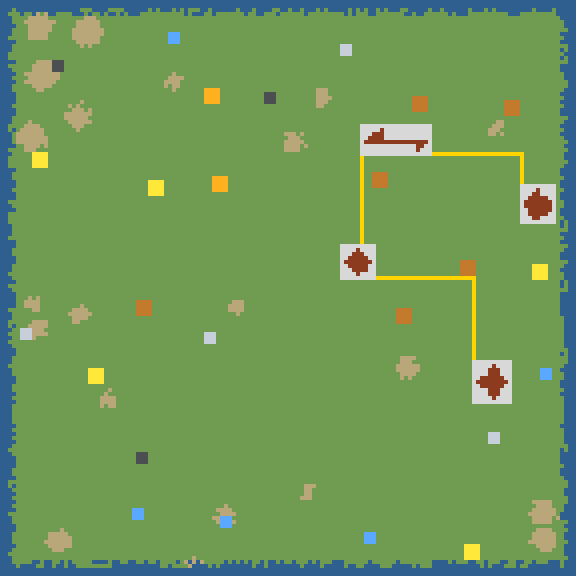
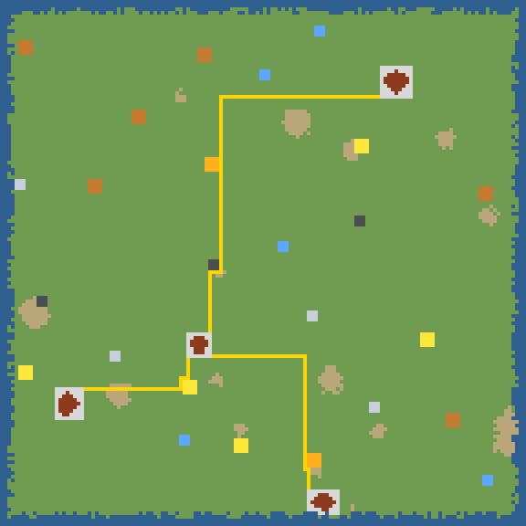

# PP-13 — forged tokens pay, towns ×3, road salvage, public highways

**Status: implemented.** Map schematics below are rendered directly from
`generateMap` output (4 px/tile), not from the renderer; real-atlas readbacks
need Chromium (`node tools/capture-iso-review.mjs`), which this sandbox lacked.

| seed 1337 | seed 7 |
|---|---|
|  |  |

Legend: green grass, tan rough, blue water; coloured squares industries;
brown house tiles + light-grey ring each town's roads; **yellow the public
highways**. On both seeds every town sits on one yellow network.

## 1. Match-4 forged tokens pay (the bug)

A 4-in-a-row mints a tier-1 token of its own colour (5+ mints tier-2). That
token was gated behind the J1 reachability rule, so matching it with two more
gems credited nothing unless a depot already reached that cargo's industry —
the long match's whole reward was silently worthless. Gems now carry
`forged`; `onHarvest(res, amount, forged)` returns whether the payout landed,
and the quarry pays a forged token unconditionally while network-spawned
tokens stay gated and still route to `onBlocked`. `onPopup` trusts the board's
accumulated gains, so the readout can only show what reached the purse.
`demoteTokens` no longer strips a forged token when a line drops.

Pinned in `tests/unit/iso-forged-token.test.ts` (6 tests). Against the pre-fix
tree 5 of 6 fail; the one that passes is the regression guard proving a
*network* token is still refused when its line is cut.

## 2. Towns three times bigger

`TOWN_HOUSES_MIN/MAX` 6..12 → **18..36**. Streets and the ring road derive
from the house bounding box, so the footprint triples with the count. Measured
town-layer tiles (houses + ring):

| seed | houses (per town) | total |
|------|-------------------|-------|
| 1337 | 122 (26/34/27/35) | **425** (was 135) |
| 7 | 96 (19/22/29/26) | 261 |

All four towns still place on every standard seed (pinned in
`iso-grid.test.ts`).

## 3. Demolishing a road salvages one material

`doDemolish` credits exactly one unit, drawn at random from
`ROAD_DEMOLISH_REFUND = ["wood", "stone"]` — so 1 Wood **or** 1 Stone, never
both. A road costs 1 Wood + 1 Stone, so this is a half-refund: re-routing a
mistake costs one material per tile, never free and never profitable. Rail
pays nothing (its price is dominated by 4 Ore, and the upgrade path is what
rail is for).

## 4. Public highways connect the towns

`publicRoadTiles` builds a Prim MST over the town centres (Chebyshev, lowest
index breaks ties) and paves each edge with a multi-source BFS between the two
towns' own road networks — deterministic, **no RNG draws**, never through
water, an industry footprint or a house. `seedPublicRoads` stamps them with
`PUBLIC_OWNER = 3` (players 1/2, town furniture 0) after `seedTownRoads`, so
a town keeps its neutral ring. The new `trackOpenTo(track, owner, tx, ty)` —
own track **or** public, never the rival's — is the single rule every
connectivity site now goes through: `economy.buildComponents`,
`economy.isServiced`, `track.playerNetwork`, `ai.planFeasibility`. Owner 0 is
deliberately unchanged, so town furniture never becomes a network.

**A highway cannot be taken or torn up.** `tileCost` charges nothing for a
tile already carrying the same kind, so dragging a road over a highway would
have re-stamped every tile it crossed into the builder's private network for
free — the player, and the AI, would have eaten the shared road within
minutes. `buildTile` refuses to change the owner of a `PUBLIC_OWNER` tile;
the route still connects and renders, it just stays public. `doDemolish` only
tears down track whose owner is the player clicking, and says so.

Pinned in `tests/unit/iso-public-roads.test.ts` (14 tests). The non-claim test
fails against the pre-guard `buildTile`.

## Consequential changes

- `SNAPSHOT_VERSION` 5 → 6: a v5 guest would regenerate a different map from
  the same seed, so mixed-version rooms must refuse.
- Corridor-picker seeds re-swept (the bigger towns move every settlement):
  16 seeds qualify at both boot zooms, up from 9. e2e/unit 74 → 79, E14
  33 → 117.
- Test budgets: `vitest.config.ts` now sets `testTimeout`/`hookTimeout` 30 s
  (the suite is a simulation harness; the 5 s default was already marginal),
  and two per-test budgets were raised. No assertion changed.
- Two drive-by fixes in `iso-town-roads.test.ts`: a stale `playerNetwork`
  import from `economy.ts` (never exported), and an owner-scoping test that
  probed only the four neighbours of `towns[0].roads[0]` — all town furniture
  now, so it ran zero assertions.
- The e2e drag had a latent footprint bug: the spec skipped a hard-coded 2×2
  window around the factory anchor, but PP-12 doubled every footprint to 3×3.
  CI failed on (30,135), then again on (31,135) — one tile past the footprint,
  since the sprite's reach is set by the atlas's stage-2 alpha. The decision
  now belongs to the game's own pick: `classifyDragTiles(corridor, clickable)`
  asks per tile, and the spec asserts the Factory is the **only** reason any
  corridor tile is skipped. Pinned browser-free in
  `iso-corridor-picker.test.ts`.

## Verification

`npx vitest run` 36 files / 557 tests (baseline 34 / 530); `tsc` clean on both
configs; `lint` 0 errors, 25 warnings (baseline); CI `test` **pass** (2 m 18 s)
and `e2e` **pass** (1 m 12 s, desktop-chromium).
