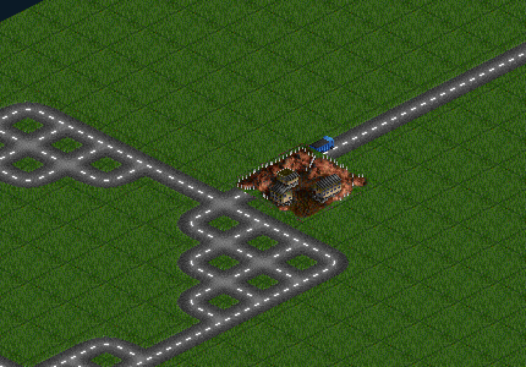
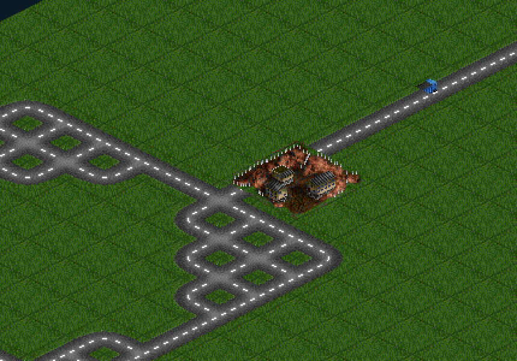

# RV-01 — road vehicles: the lorry that proves a connection

**Status: implemented** (this report rendered headlessly — this sandbox has no
Chromium; the depot-end crops below come from the software rasteriser used by
`iso-golden`, consuming the real atlas, real `place`/`depthSort` and the real
`planTrucks`/`tickTrucks` output on seed 1337).

Depot (gold, iron-ore-mine art) parked beside the public highway, no
player-laid road anywhere; the lorry is mid-route heading NE — first just
north of the depot, then ~1.8 tiles up the chain:

| t = 0.9 s | t = 2.6 s |
|---|---|
|  |  |

## The feature

When a Depot reaches a Factory by **road**, the game now shows the route the
economy already scores: one TTD goods lorry per player drives it,
**depot → factory → depot**, forever. A connected network has traffic on it;
a broken one goes quiet. The lorry is OpenGFX's 2nd-generation goods truck
(spr3132, `base-3092-road-vehicles.pnml`), the same GPLv2 art pipeline as
everything else on the map.

## Why the route is trustworthy

`vehicles.roadPath` is the economy's flood with parents: multi-source BFS
over `trackOpenTo` tiles (own track **+ the PP-13 public highways**, never
the rival's — W2 stands), crossing only **mutually facing** direction bits
(E5's invariant). It returns the actual tile route, so:

* a Depot and a Factory parked on opposite sides of a highway — **no
  player-laid road at all** — still get their truck over the shared network;
* both players get their **own** truck over the **same** public tiles;
* a half-autotiled stub can never carry traffic;
* `planTrucks` refuses rail-only connections (trains are not this ticket)
  and unserviced depots.

One truck per player, picked from the first serviced Depot in stable network
order; replanned only when the network changes (every build/demolish funnels
through `rescoreNow`, which sets `trucksDirty`).

## Motion and drawing

* `TRUCK_SPEED = 1/600` tiles per ms (one tile every 0.6 s).
* Position is **phase along a triangle wave** over the route (`leg + t`,
  `reverse`), folded by reflection — a huge dt turns the truck around at the
  exact end tile instead of pinning or teleporting it; the frame loop caps
  dt at 100 ms so a background tab doesn't launch it either.
* `DrawItem` grew an optional **fractional tile position** (`fx`/`fy`).
  `depth.place` anchors a moving item at the fractional tile's **diamond
  centre** (a vehicle's ground point) instead of the south-corner rule,
  depth-keys it by the **rounded** tile (draw order flips exactly as it
  crosses a tile boundary), and `pickSprite` skips it — a truck is never a
  clickable thing, clicks fall through to the map.
* The renderer takes `world.vehicles`, culls with the extras' pad, and
  depth-sorts trucks **with** the structures so buildings occlude a lorry
  passing behind them; while any truck exists the structures pass redraws
  every frame (`hasAnimation`), and a replan re-flags the layer so a
  vanished truck can't ghost.

## Atlas / pipeline

* `cells` gained four verbatim `file` cells (`vehicles/ttd/goods_lorry_*.png`,
  cropped from the OpenGFX sheet with the exact-`#0000FF` mask → transparent,
  as `extract2.py` does); the four **diagonal** views are the only ones an
  iso road can express — N/S/E/S views don't apply to this project's 4-bit
  diamond world.
* Manifest entries carry `moving: true` (schema-validated): the sanctioned
  exception to the V1 small-art invariant — a vehicle's art is deliberately
  smaller than its footprint diamond because it reserves no ground; the 1×1
  footprint exists only for depth spans and culling. The validator, the
  slicer pass-through and `iso-manifest` all agree.
* `makeFile`'s opaque-bbox trim means SE/SW pack at 20×15 (one transparent
  row gone); NE/NW stay 20×16. Anchors stay bottom-centre (10, h−1) — the
  ground contact.

## Invariants pinned (`tests/unit/iso-vehicles.test.ts`, 20 tests)

* atlas ships all four views, 1×1, `moving`, bottom-centre anchors;
* `roadPath`: routes over a public highway between two own tiles; never
  across the rival's; respects mutual bits; degenerate start=goal and empty
  sources;
* `planTrucks`: **highway-only** connection yields a route whose every tile
  is open to the owner, mutually connected, and touches public tiles; both
  players truck the same shared tiles; own-road connections route too;
  unserviced/rail-only yield `[]`; stable network-order pick;
* `tickTrucks`: forward, reflect at the factory end, reflect at the depot
  end, holds still on a 1-tile route, ignores non-positive dt;
* draw items: interpolate between tile centres, sprite flips with direction
  (SE/NW/SW/NE all pinned), fractional placement lands the anchor on the
  diamond centre, depth key flips at the rounded-tile boundary, and
  `pickSprite` falls through a truck but still picks a depot underneath.

## Verification

`tsc` clean on both configs; `npm run build` clean; `lint` 0 errors
(warnings at the documented baseline); unit suite green (37 files /
577 tests, +20 over baseline). Playwright could not install in this sandbox
(CDN blocked, same as the PP-13 report), so the browser-level check is the
vite dev server + the software-rendered crops described above.
