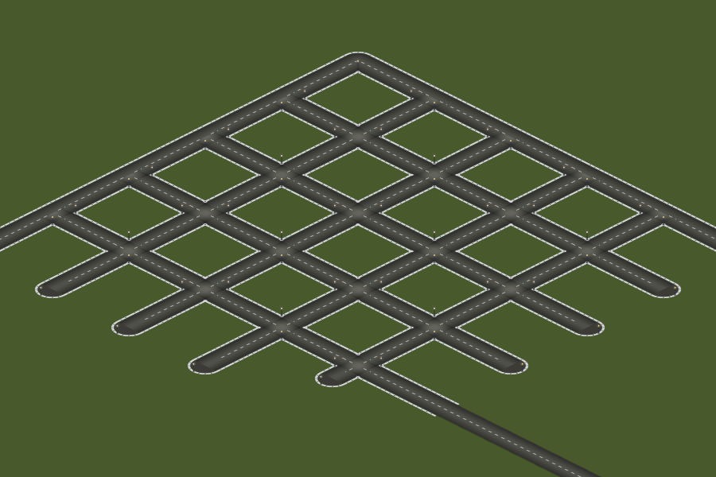
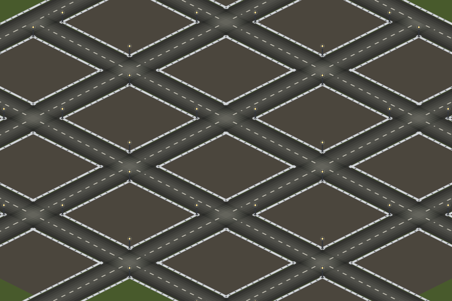
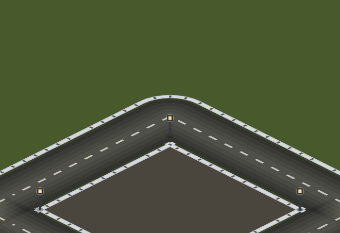
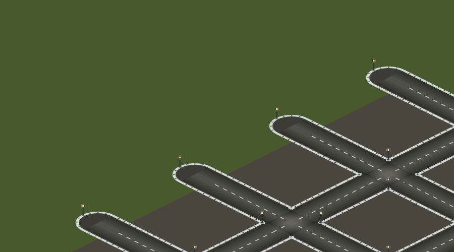
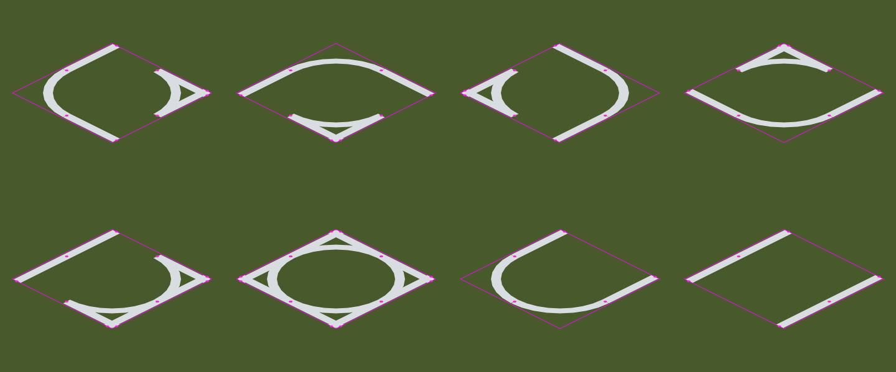

# #159 — town-street sidewalks, corner lamps and paved blocks

**Status: implemented.** This report rendered headlessly: this sandbox has no
Chromium (the Playwright download is blocked), so the images below come from
the shipped `paintRoadTiles`, driven through an SVG backend for
`CanvasRenderingContext2D` that rasterises the real path geometry with the real
palette. Everything the pictures show is drawn by the code that draws it in the
game; only the rasteriser underneath is different. The live Vite preview is the
place to judge the real canvas.

## The feature

A paved road inside a town's limits is now drawn as a **town street**, not as a
rural highway. Three parts:

1. **Sidewalks.** Light grey concrete ribbons run down both flanks of the road,
   outside the dark gutter that the shoulder already provides, with a
   translucent crown down the middle of each ribbon so the walkway reads as a
   slab rather than as paint. The cross-section, from the road's centre-line
   out: asphalt `0.39` · gutter `0.03` · sidewalk `0.07` · frontage `0.01`.
2. **Concrete-slab joints.** One projected pixel of dark ink across each ribbon
   every `0.18` of a tile, inset `0.012` at each end. The light grey perimeter
   that survives around every joint is the whole illusion: the ink never
   touches the edge of the walkway, so each block reads as a raised, bevelled
   slab instead of two strips of paint.
3. **Corner street lamps.** A 3px lantern on an 8px iron post, warm glass and a
   soft contact shadow, at the walkway's corners: the outside of every bend,
   both corner aprons of a T-junction's branch, two opposite corners of a
   crossroads (the diagonal alternates with the tile, so a street of crossroads
   alternates instead of stamping), and the apex of a dead end's cap.

And, following the first review pass, **the paved blocks between the streets**:
every tile a town's houses stand on is paved to the kerbs around it, so a
settlement reads as one made surface from street to street rather than as
lawns with roads between them.

| before (streets only) | after |
|---|---|
|  |  |

The paved blocks, the kerbs they tuck under, and the lamps that stand on them —
a crossroads at 4×:

## The town limits

Paving stops where the town does. A tile is a town street because the map
stamped it `TOWN_OCC` (`isTownTile` — a town's streets and houses are stamped,
an inter-town highway deliberately is not), and a tile is paved block ground
because a town's `houses` list has a house on it. Nothing here asks the road
bytes who owns the asphalt, so a player's own road through a town is a town
street and the highway outside it keeps its rural verges.

The town's edge: paving and lamps stop, the highway beyond keeps its shoulders:

## The corner that was missing

The first pass gave a bend two arcs, one at each side of the road, and then a
later simplification — "the walkway turns where two arms meet" — dropped the
inner one. The inside of every bend then had a sidewalk down each arm and
nothing across the corner between them: a notch of grass at exactly the kerb
line a driver looks at while turning. The rule is now symmetric and covers all
three cases at once, from one predicate:

| quadrant's two arms | what the walkway does |
|---|---|
| **both** | turns between two ribbons: a bend's outside sweep, or a kerb corner at a junction |
| **neither** | turns the other way: a bend's inside **kerb return**, or a dead end's cap |
| **exactly one** | runs straight through: no corner, no arc |

The gallery below is one tile of each shape: four bends (row 1), a T, a
crossroad, a dead end and a straight (row 2). The pink diamonds are the tiles;
the dots are the ends of every ribbon. Every end is either on the tile's edge —
where the neighbour's walkway continues it — or shared with another end of the
same tile, which is what a turn does. There is no dangling end anywhere.

## Where the work lives

* `src/iso/road-geometry.ts` — the walkway as paths (`sidewalkPaths`), the
  joints along them (`sidewalkJoints`), the lamps (`streetLampSpots`) and the
  block paving (`townGroundQuad`). Pure ground-plane geometry, no canvas.
* `src/iso/road-renderer.ts` — four new passes in `paintRoadTiles`: town
  ground, sidewalks, joints, lamps. Each batches every figure in the chunk into
  ONE path, so a whole town's walkways cost two strokes and its joints one,
  however many blocks it has.
* `src/iso/grid.ts` — `townGroundBytes`, the per-grid derivation of the paved
  ground, cached like the existing ground contours.
* `src/iso/renderer.ts` — hands the road cache a view of the world carrying the
  map, and passes that view to `RoadCache.paint`.

## Why the cache still holds

Everything above is drawn inside the same cached chunk raster as the asphalt,
keyed on the same `(zoom, chunk)` and invalidated by the same tile edits, so
the per-frame cost is unchanged: a frame blits the chunk, it does not paint
sidewalks. Three properties are what keep the caching sound, and each is pinned
by a unit test:

* **A ribbon stays inside its own tile** (`SIDEWALK_OFFSET + SIDEWALK_WIDTH/2`
  = 0.49 < 0.5), so two tiles — and therefore two chunks — butt-join at the port
  with no shared state and no double paint.
* **The joint lattice is absolute**: joints fall at `0.09 + k·0.18` in world
  coordinates, the same lattice for every tile and every chunk, with the ones
  that would touch a port dropped rather than allowed to overhang.
* **Town ground is per tile**, reaching `0.06` under a kerb it shares with a
  street — past the 0.01 hairline it has to cover, well short of the 0.11 to
  the asphalt. All a chunk's quads are filled in ONE path, so where two blocks
  reach under the same street their overlap cannot double the wash.

## Verification

* `tests/unit/iso-sidewalk.test.ts` — 36 tests: the walkway's cross-section and
  handshake at every port, the turn rule for all sixteen masks, joints (spacing,
  inset, phase, port safety), lamps (on the walkway, never in the carriageway,
  one per bend, alternating at crossroads), the block paving (abutting, reaching
  under kerbs, the generator's own towns), and the cache behaviour (rasterised
  once, then blitted).
* `npm run typecheck`, `npx eslint` on the changed files: clean.
* The remaining unit suites were run before the PR; see the PR description.
* Not verified here: the browser-rendered look and the frame rate. `RoadCache`
  statistics are exposed on `__iso.rendering()` (`cache.misses`, `blitsLastFrame`,
  `townGroundTiles`) for a pass on the live preview.
