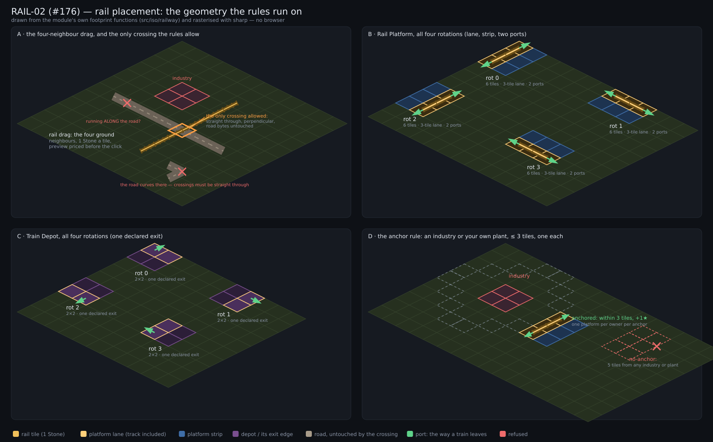

# RAIL-02 — rail placement, platforms and level crossings



*(The figure is drawn from `src/iso/railway`'s own footprint functions — the same
tiles the rules test — and rasterised with sharp, so it can be regenerated in CI
where there is no browser:*

```bash
PREVIEW_RAIL=1 npx vitest run tests/unit/iso-railway-figure.test.ts   # → docs/railway-02/preview.png
```

*Rail sprites are #177; what is visible today is the geometry the placement
rules run on, which is what this ticket owns.)*

## What shipped

The railway is a **third surface** on the same 144×144 grid, beside the two road
tiers — not a re-skin of them. `src/iso/railway/` is one module with four files:

| file | what it owns |
|---|---|
| `state.ts` | the rail layers (`rail` mask, `railOwner`, `occ`, `occOwner`), the records (platform, depot, train, line), stable ids and `revision` |
| `geometry.ts` | footprints, quarter turns, ports and the anchor maths — one place, so the preview, the commit and a test cannot disagree |
| `placement.ts` | the rules: drag preview/commit, level crossings, structure plans and builds, demolition and refunds |
| `connectivity.ts` | the owner-scoped flood: components, network reads, and the trains sitting on them |

### Separate owner-scoped layers — never the road's bytes

`rail` and `railOwner` are new `Uint8Array`s. `track.ts`'s four arrays carry road
semantics (the merged gravel/tar surface, the public-highway owner, and VP-01's
pave provenance the scoreboard reads): writing rail into them would silently
score, autotile and flood as *road*, which is the exact bug class this split
prevents.

Occupancy is its own layer too (`occ` + `occOwner`, one byte per tile:
free / rail / platform / depot), so a structure can never half-overlap another
structure's ground and two footprints can never interleave.

Rail is **private**: there is no public rail and no sharing, so the autotiler's
"does this neighbour connect" test is owner-scoped. An opponent's line touching
yours is two surfaces standing side by side; a bit pointing across that seam
would draw a junction no train of either seat could ever use.

### The drag

Four ground neighbours, no diagonals. A drag is an L-shaped Manhattan path
(`lPath`, `xFirst` for the axis order), priced per tile, and it **truncates** at
the first refusal — the legal, affordable prefix is what gets built, which is
what makes a mis-dragged mouse harmless. Dragging over your own rail is a free
no-op, not a second charge. Everything not built is reported (`unaffordable`,
`truncated`, `reason`) so the preview can paint it.

`commitRailDrag` re-validates **every** tile against the current world before a
single byte changes, then applies inside a clone/restore. Two seats that
previewed the same ground both reach it; the first builds and pays, the second
finds the ground changed and is refused **whole** — no half-built drag, no
charge for a refusal.

### Level crossings

A road may be crossed, and only where the rules allow:

| requirement | refusal |
|---|---|
| the road runs straight through (two opposite bits, nothing else) | `road-end`, `road-curve`, `road-junction` |
| the rail runs straight through the road tile | `crossing-curve` |
| the rail is perpendicular to the road | `crossing-skew` |
| no rail branching off an existing crossing | `crossing-branch` |

The road's bytes are never touched: owner, tier and the 0.25★ pave provenance
come out of the crossing exactly as they went in, and no traffic transfers
between the two graphs. Town roads are not crossable (a town tile is
`TOWN_OCC`); a public highway is.

### Platforms and depot

* **Platform** 2×3, rotatable: a **three-tile lane** (the track, included in the
  price) with two rail **ports** at its ends, and a three-tile strip beside it.
* **Train depot** 2×2, rotatable, with **one declared exit** — the port is
  stored on the record and validated against the rotation (`bad-port`), so a
  snapshot cannot quietly point a depot's exit at the side its track never
  reaches.
* **Anchor**: an industry or **your own** processing plant within Manhattan
  distance 3, footprint cell to footprint cell. One platform per owner per
  anchor; when several qualify the plan comes back `anchor-ambiguous` and the
  player chooses — the choice is stored, never re-derived.
* Structures need the ground itself: roads and any rail (own included) are in
  the way, so a platform never silently eats a paid tile.

### The train guards

* Every edit is refused on a tile a train physically stands on
  (`train-occupied`) — building, crossing and demolition alike.
* A drag that would **merge** two components which each already hold a train is
  refused whole (`train-limit`) and rolled back byte for byte. That is v1's
  one-active-train-per-connected-component rule, enforced where merges happen.

### Money

Prices come from the one authoritative table (`BUILD_COSTS` in `config.ts`):
rail 1 Stone, platform 4 Wood + 4 Stone + 12 Ore + 2 Oil, depot 3 Wood +
3 Stone + 4 Ore + 2 Oil, train 4 Ore + 2 Oil. The free setup allowance does not
apply to rail. Demolition returns `floor(50%)` of each resource, which for
1-Stone track is nothing and for a platform is half of everything — and the
platform's 1★ is not booked here at all: the scoreboard **diffs** the standing
platforms (`victory.ts`), so a rebuild cycle ends where it started.

## Tests

| suite | what it pins |
|---|---|
| `tests/unit/iso-railway-state.test.ts` (19) | layers, owner-scoped autotiling, ids, occupancy reservation, clone/restore, costs |
| `tests/unit/iso-railway-placement.test.ts` (24) | preview/commit agreement tile-for-tile (both axis orders, all four map borders), truncating refusals, the crossing table, dirt **and** paved roads, refunds, simultaneous conflicts |
| `tests/unit/iso-railway-structures.test.ts` (18) | all four rotations of both structures, the anchor rule, occupancy, demolition, and both train guards |
| `tests/unit/iso-railway-figure.test.ts` | the figure above (skipped unless `PREVIEW_RAIL=1`) |

`npx vitest run tests/unit/iso-railway-*.test.ts` → **61 passed**.
Full suite: **1942 passed, 2 pre-existing failures** in `tests/unit/iso-mp.test.ts`
(cargo-icon labels; the same two fail at the base commit `a4511d8`, verified in a
clean worktree — unrelated to this ticket).

## Deliberately not here

* **Art** — rail tiles, crossings, platform and depot sprites are #177.
* **The construction UI** — toolbar, rotation keys, the anchor chooser, toasts
  from `RAIL_REASON_TEXT`: #179. Nothing of this ticket's rules lives in `game.ts`
  or `ui.ts`; the UI will call the same module the tests call.
* **Depot ops, lines and trains that move** — #178. RAIL-02 owns only what
  placement needs from a train: who owns it and which tiles it occupies.
* **Multiplayer and snapshots** — #181. The railway state is not yet in the
  snapshot payload or the net delta.
* **Balance** — the prices above are the epic's provisional tuning constants and
  remain subject to #182's gate.
