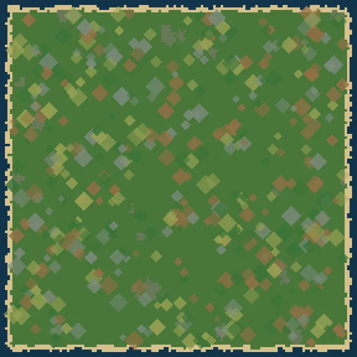
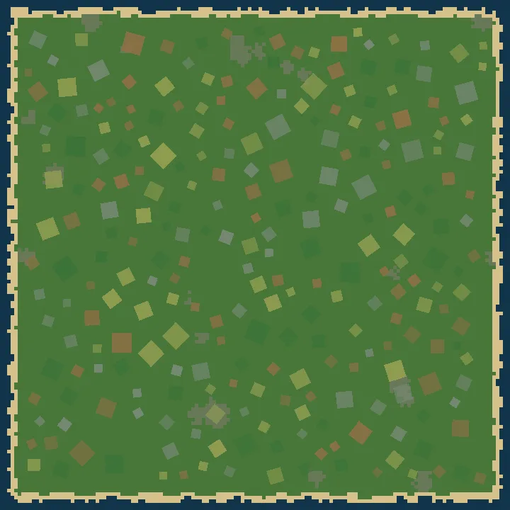
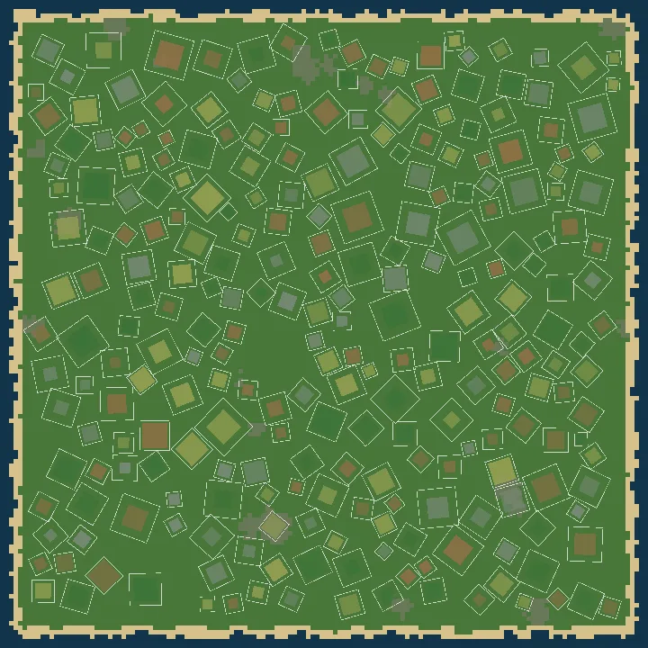

# Ground decal placement, redone

Based on main `f221a6cda89f4c8b2981fbc629e0b86f3ff3f25c`.

The decals — the bare-earth and grass-mood patches painted on the meadow — were
being placed without a model of the ground they actually cover. This page is
the before/after for the redo in `src/iso/scenery.ts`.

## What was wrong

Measured on seed 1234 (the numbers are from the scatter itself, not eyeballed):

- **476 patches, 295 of them overlapping pairs**, the worst by ~4 tiles. The
  scatter had no overlap rule at all: it drew `land × density` attempts and
  took every one that passed a single-tile test.
- **Clustering.** A patch was a tile plus a fixed ±23px / ±12px nudge, so two
  draws on the same or neighbouring tiles sat almost on top of each other and
  read as one clump — 11 tiles carried more than one patch. The nudge was also
  the same for every patch, so the layout sat on a visible jittered lattice.
- **The shoreline rule under-protected by about 2×.** A `w × w/2` blit is not a
  ground square of `w/64/2` tiles: invert the projection on the rect's corners
  and they land on the ground AXES at ±w/64 tiles. One patch is a square turned
  45° to the tile grid, tip to tip `w/64` tiles on each ground axis — twice the
  radius the shore test compared against `waterDistance`, which is why patches
  feathered onto the beach and, at corners, into the surf.
- **The paint pass did trig-grade arithmetic per patch per frame** (`Math.ceil`,
  two divisions) for a cull that ran over all ~476 patches every frame, and the
  overlaps meant the same soft rims were alpha-blended two or three times.

## What it is now

`scatterDecals` places each patch whole and alone: size, turn, padding, family,
variant, opacity and mirror are drawn before it looks for ground, and nothing
seeds a patch from a neighbour. Two tests answer each candidate:

1. **Shoreline.** `coastClearance` — the chessboard distance from every tile to
   the nearest sea tile or stage edge, i.e. the largest water-free TILE BOX
   around the tile — must clear the patch's turned art box, the patch's own
   padding, and `DECAL_SHORE_PAD = 2` tiles of grass. A two-pass raster
   transform computes the field in about a seventh of the BFS's time (1.3 ms
   against 9.5 ms on a 144×144 map); a test cross-checks it against
   `chebyshevField` on the same sources.
2. **No overlap.** The patch's ink square (its ground square at `DECAL_INK`,
   turned) grown by its own padding must not touch any patch already down: a
   separating-axis test over the four edge normals, looked up through a uniform
   spatial hash so a candidate sees a handful of neighbours, not the map.

The centre is a uniformly random point inside a uniformly random eligible tile,
so patches sit off the lattice and — the exclusion rule being wider than a
tile — one patch per tile is a consequence, not a rule. Turns are continuous
over `[0, 2π)` and ride in the blit as the ground-plane rotation
`S·R(θ)·S⁻¹ = [[cos θ, −2 sin θ], [½ sin θ, cos θ]]`, which keeps the patch
lying flat instead of tilting the 2:1 art like a stuck-on label. The attempt
budget is bounded (`target × DECAL_ATTEMPTS`), so a crowded map stops at "as
many as fit" instead of spending unbounded time looking for room.

Seed 1234 after: **255 patches, zero overlapping pairs, zero shore violations,
255 distinct tiles, every centre off the lattice**, turns spread evenly over
eight sectors, paddings spread over the whole `0.4…2.2` band. Total ink ~20% of
eligible ground, painted once each.

## The layout, top down

Seed 1234, ground space (one tile ≈ 5px), families coloured, alpha as painted.
These are software raster previews of the placement, not browser screenshots.

Before — overlaps, diagonal clumps, and ink feathering onto the beach:

After — independent patches, individually padded, clear of the shoreline:

The rule each patch holds, drawn in white: its ink square plus its own padding.
No two outlines cross, and none reaches the sand:

## Validation

- `tests/unit/iso-scenery.test.ts`: the overlap contract is checked twice —
  once with the scatter's own predicate and once by sampling a lattice across
  each patch's ink and measuring the distance to its neighbour's ink, so the
  rule cannot pass by agreeing with itself; the shore rule is checked against
  `coastClearance` and `coastClearance` against the BFS; the paint pass is
  checked against the projection (a quarter turn lands on the same ground, a
  45° turn becomes a √2 diamond, the mirror rides in the same matrix).
- Full unit suite: same result as main — the 20 failures already present on
  main (corridor picker, vehicles, noir theme, fx styles, placement, skill
  calibration) and nothing else.
- Trees are untouched by decal retuning: the decal pass runs on its own
  mulberry32 stream, the way the Forest-resource woods do.
- Multiplayer is unaffected: scenery stays a pure function of the seed and is
  never on the wire.
