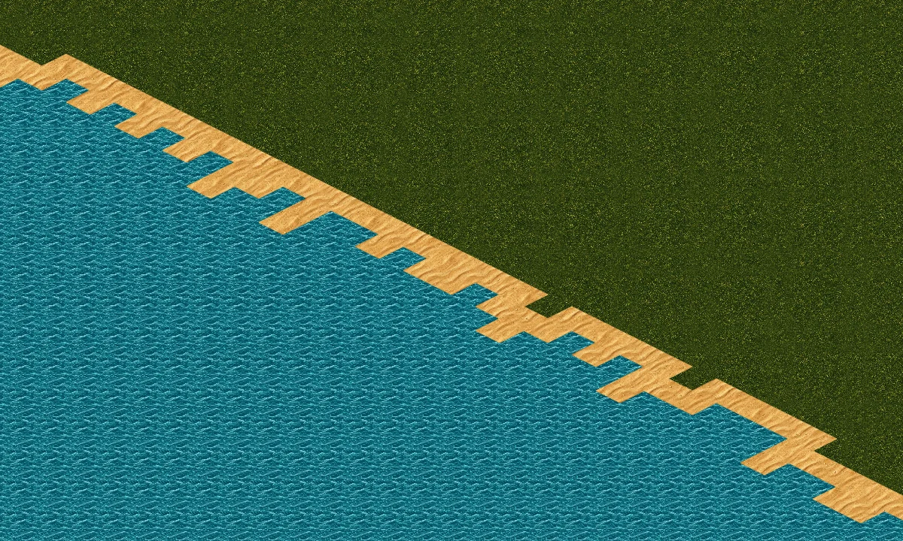
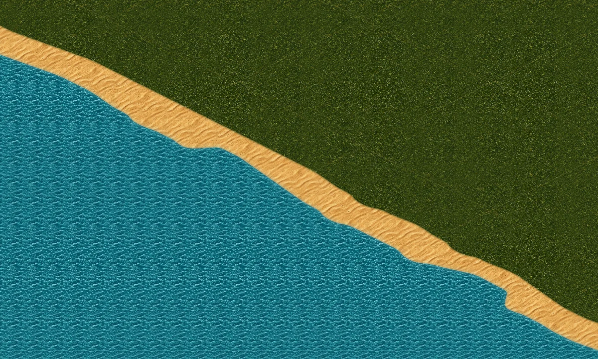

# Continuous shoreline

Based on main `42db9b922080a29fcf321000cfb0820f8c45c9cf`.

The old shoreline painted complete sand diamonds and separate shallow-water diamonds. Better textures could not hide those shapes. This change reuses the existing artwork and draws a connected, gently rounded beach instead.

## Terrain comparison

Seed 1337, south coast, 1× zoom. These are software Canvas terrain previews using the real ground painter, textures and chunk geometry, with buildings and trees omitted to expose the edge. The before image isolates the old ground fill; the after image includes the new surf. They are not browser screenshots.

Before:



After:



## Implementation

- `coastline.ts` traces tile-union boundaries, preserving hole winding and separating diagonal contacts. A bounded local average removes single-cell zigzags, followed by two corner-rounding passes in grid space before isometric projection.
- `ground.ts` caches land and inland contours per grid. Sand fills the island under grass; the space between the two contours forms the beach. A narrow grass-texture feather softens the inland edge. Broad translucent shallows and fine animated foam follow the same land contour.
- The existing 8×8 chunk cache clips those world contours with a small overlap. Pattern offsets now compensate the actual world origin, and curve coordinates retain subpixel precision. This prevents the material phase from restarting at chunk boundaries.
- After all seeded placement, `generateMap` fills narrow three-sided water notches and water disconnected from the border ocean with sand. It never removes existing land or relocates structures. The repair uses no random numbers.
- Snapshot version 11 prevents clients with different buildability from sharing a multiplayer map. Version 10 solo saves remain accepted because all existing land, industries, towns, roads and occupancy stay intact. The next save uses version 11.
- Same-grid world updates reuse contours. Changing grids or explicitly invalidating all rendering drops cached geometry; ordinary rough-to-grass flattening does not change either contour mask.

The playable grid remains diamond-based. Rendering rounds the boundary near those cells; this is not a change to tile picking or road projection. No extra generated art or runtime dependency is required.

## Validation

- Production build and lint on changed files passed.
- 85 focused tests passed across coastline, ground, grid, renderer and snapshots.
- Compared the previous main generator against the new generator for seeds 1, 42, 123, 1337 and 98765: all industry, town, public-road and occupancy data matched; every terrain change was water to sand. Two historical placement fixtures are retained as regression tests.
- Software Canvas previews inspected at 0.5×, 1× and 2×.
- Chromium could not be downloaded in the execution environment, so browser integration and browser frame-time checks remain unverified.

For a full scene browser review, start Vite and run:

```sh
npm run dev
node tools/capture-scenery-review.mjs --shoreline
```

The capture tool records all four coast orientations and a corner at every supported zoom, using the actual renderer, trees and buildings. Run this on a machine with Playwright Chromium installed. The older `PREVIEW_GROUND` test preview is a legacy diamond visualisation; use this capture command for the current coastline.
